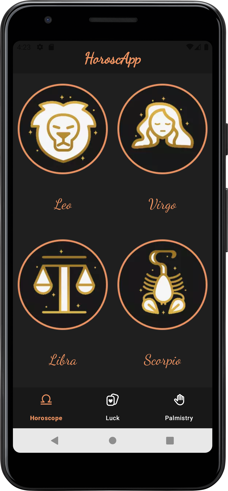
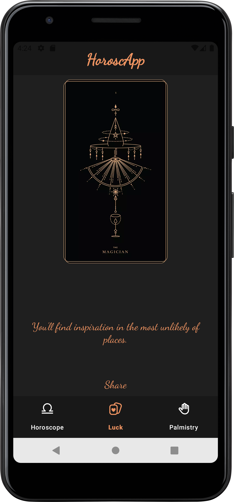
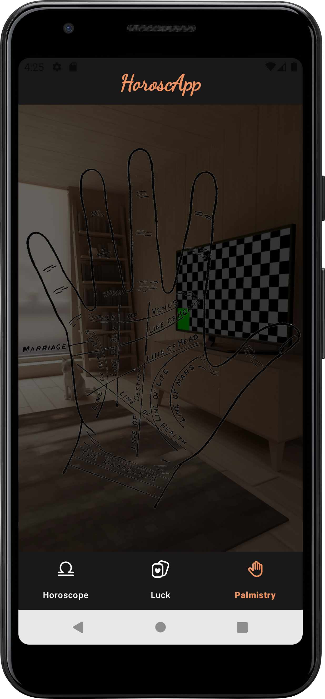

# 🔮 Horoscope App – Clean Architecture Android Project

**Horoscope App** is a native Android application that blends modern mobile development practices with a magical user experience.  
It was developed as part of the **Intermediate Android Course by Aristidevs**, demonstrating **Clean Architecture**, **Hilt dependency injection**, **StateFlow**, **coroutines**, and **UI testing with Espresso**.

<p align="center">
  
  
  
</p>

---

## 🧭 Overview

This app offers an interactive way to explore:
- **Daily horoscope predictions** by zodiac sign 🐏♋♎  
- A **lucky card roulette** with smooth animations 🎴  
- A **palmistry feature** using the device camera ✋✨  

Built on a **layered architecture (Data, Domain, UI)** with **Hilt DI**, the project is clean, modular, and easy to maintain.

---

## 🌟 Key Features

- **Zodiac list** with daily predictions  
- **Animated roulette** to reveal random lucky cards  
- **Palm scanning feature** (decorative visual component)  
- **Gesture detection (swipe)** for interactive navigation  
- **ViewModels** with **StateFlow** and **coroutines**  
- **Dependency injection with Hilt**  
- **Modern, visually immersive interface**  

---

## 🧱 Project Structure

**data/**
- **NetworkModule** – Configures Retrofit and OkHttp interceptors  
- **Repository / RepositoryImpl** – Fetches horoscope predictions from API  
- **Providers** – Static and random data (HoroscopeProvider, RandomCardProvider)  
- **Models** – Domain and response models (PredictionModel, PredictionResponse, etc.)  

**domain/**
- **GetPredictionUseCase** – Core use case for fetching predictions by zodiac sign  

**ui/**
- **Activities / Fragments** (MainActivity, HoroscopeFragment, LuckFragment, HoroscopeDetailActivity, PalmistryFragment) – Navigation and UI logic  
- **ViewModels** (HoroscopeViewModel, HoroscopeDetailViewModel, LuckViewModel) – State management with coroutines  
- **Adapters** (HoroscopeAdapter, HoroscopeViewHolder) – RecyclerView data binding  
- **Listeners** (OnSwipeTouchListener) – Swipe gesture detection  

**di/**
- **Hilt modules** for dependency injection (e.g., NetworkModule)  

**utils/**
- **AuthInterceptor, TokenManager** – Placeholder for authentication logic (currently empty)  

---

## ✅ UI Testing with Espresso + Hilt

This project includes **instrumented UI tests** to validate navigation and screen behavior using **Espresso** with **Hilt** for test dependency injection.

### Tests Included

**`MainActivityTest.kt`** (`ui/home/`):  
- `when_mainactivity_is_created_then_open_luckfragment()` – Verifies that tapping on the **lucky card tab** correctly opens the fragment.  
- `when_horoscope_is_selected_then_open_detail()` – Verifies that tapping on a **zodiac sign** opens the **HoroscopeDetailActivity** screen.  

### Technologies Used in Tests
- **Espresso** – Simulates user interactions (clicks, scroll, navigation)  
- **Espresso Intents** – Validates screen transitions  
- **HiltAndroidRule** – Enables Hilt for instrumentation tests  
- **ActivityScenarioRule** – Launches activities for testing  

### Custom Test Runner

The project includes a `CustomTestRunner` configured for Hilt testing:
```kotlin
class CustomTestRunner : AndroidJUnitRunner() {
    override fun newApplication(cl: ClassLoader?, className: String?, context: Context?): Application {
        return super.newApplication(cl, HiltTestApplication::class.java.name, context)
    }
}
